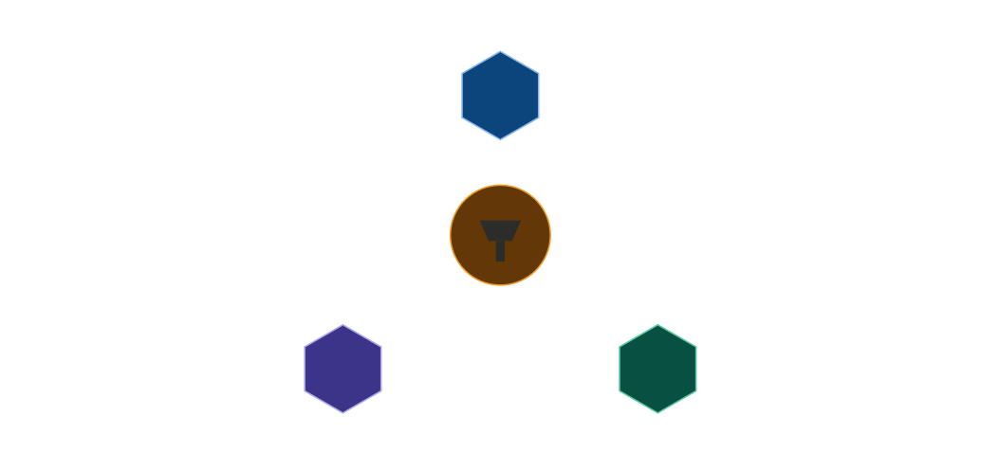

# Distrilimit

Distrilimit is a TypeScript rate-limiting middleware for Express. It exposes a simple `rateLimit(options)` API and lets you choose the storage backend.

# Project Logo
  

## Badges

<p align="left">
  
  
  
</p>

## Install

```bash
npm install distrilimit
```

## What You Get

Distrilimit currently supports these strategies:

- `token-bucket`
- `sliding-window-log`
- `sliding-window-counter`
- `fixed-winodw`
- `leaky-bucket`

Store choices:

- `MemoryStore` as the default when no store is passed
- `RedisStore` for production or shared limits

## Package Imports

If you want to import the helpers directly, use this public API:

```ts
export { RedisStore } from "./store/RedisStore";
export { MemoryStore } from "./store/MemoryStore";
export { rateLimit } from "./rateLimit";
```

Then you can do:

```ts
import {
  rateLimit,
  RedisStore,
  MemoryStore,
} from "distrilimit";
```

## Quick Start

The most common usage is to install the package and use it directly in an Express app.

```ts
import express from "express";
import { rateLimit } from "distrilimit";

const app = express();

app.use(
  rateLimit({
    strategy: "token-bucket",
    capacity: 10,
    refillRatePerSecond: 2,
  })
);

app.get("/profile", (req, res) => {
  res.send("ok");
});

app.listen(3000, () => {
  console.log("Server listening on 3000");
});
```

If you do not pass a store, Distrilimit uses `MemoryStore` automatically.

## How To Use It

### 1. Default MemoryStore

Use this for local development, testing, or single-process apps.

```ts
import express from "express";
import { rateLimit } from "distrilimit";

const app = express();

app.use(
  rateLimit({
    strategy: "leaky-bucket",
    capacity: 5,
    leakRatePerSecond: 1,
  })
);

app.listen(3000);
```

### 2. RedisStore For Production

Use this when you want shared limits across multiple app instances.

```ts
import express from "express";
import { rateLimit, RedisStore } from "distrilimit";

const app = express();

const store = new RedisStore("127.0.0.1", 6379);

app.use(
  rateLimit({
    strategy: "leaky-bucket",
    capacity: 5,
    leakRatePerSecond: 1,
    store,
  })
);

app.listen(3000);
```

### 3. Fixed Window

Use the current fixed-window strategy literal from the codebase.

```ts
import express from "express";
import { rateLimit } from "distrilimit";

const app = express();

app.use(
  rateLimit({
    strategy: "fixed-winodw",
    capacity: 100,
    windowSizeMs: 60_000,
  })
);

app.listen(3000);
```

### 4. Sliding Window Counter

```ts
import express from "express";
import { rateLimit } from "distrilimit";

const app = express();

app.use(
  rateLimit({
    strategy: "sliding-window-counter",
    capacity: 100,
    windowSizeMs: 60_000,
  })
);

app.listen(3000);
```

## Strategy Reference

### Token Bucket

Best when you want burst tolerance.

Options:

- `capacity`: maximum tokens in the bucket
- `refillRatePerSecond`: tokens added every second

### Sliding Window Log

Best when you want exact per-window tracking.

Options:

- `capacity`: max requests in the window
- `windowSizeMs`: size of the moving window

### Sliding Window Counter

Best when you want a cheaper approximation than the log.

Options:

- `capacity`: max requests in the window
- `windowSizeMs`: size of the moving window

### Fixed Window

Best when you want simple rate limiting behavior.

Options:

- `capacity`: max requests in the window
- `windowSizeMs`: size of the window

### Leaky Bucket

Best when you want smooth output with controlled draining.

Options:

- `capacity`: max queue/bucket size
- `leakRatePerSecond`: leak rate in requests per second

## Response Shape

The middleware sets standard rate-limit headers:

- `RateLimit-Limit`
- `RateLimit-Remaining`
- `RateLimit-Reset`
- `Retry-After`

If the request is blocked, the response result includes:

```ts
{
  allowed: boolean;
  retryAfterMs: number;
  limit: number;
  remaining: number;
}
```

## Custom Key Generator

By default, Distrilimit identifies clients using `req.ip`.

You can provide a custom `keyGenerator` to rate limit by user ID, API key, tenant ID, or any other unique identifier.

### Rate limit by authenticated user

```ts
app.use(
  rateLimit({
    strategy: "token-bucket",
    capacity: 10,
    refillRatePerSecond: 2,

    keyGenerator: (req) => req.user.id,
  })
);
```

### Rate limit by API key

```ts
app.use(
  rateLimit({
    strategy: "token-bucket",
    capacity: 20,
    refillRatePerSecond: 5,

    keyGenerator: (req) =>
      req.headers["x-api-key"] as string,
  })
);
```

The value returned from `keyGenerator` is used as the unique identifier for rate limiting.

---

## Custom Block Handler

By default, Distrilimit responds with **HTTP 429 (Too Many Requests)** when a client exceeds the configured limit.

You can customize this response using the `handler` option.

```ts
app.use(
  rateLimit({
    strategy: "token-bucket",
    capacity: 5,
    refillRatePerSecond: 1,

    handler: (req, res, result) => {
      return res.status(429).json({
        success: false,
        message: "Rate limit exceeded",
        retryAfterMs: result.retryAfterMs,
      });
    },
  })
);
```

The custom handler is invoked only when a request is blocked. If no handler is provided, Distrilimit sends its default `429 Too Many Requests` response.


### Throughput Benchmark

Example table:

| Algorithm | Time (ms) | Latency (ms/request) | Throughput (req/s) | Allowed |
| --- | ---: | ---: | ---: | ---: |
| Token Bucket | 369 | 0.369 | 2710.0271 | 1000 |
| Sliding Window Log | 358 | 0.358 | 2793.2960 | 1000 |
| Sliding Window Counter | 404 | 0.404 | 2475.2475 | 1000 |

### Rate-Limit Behavior Benchmark

Example table:

| Algorithm | Requests | Allowed | Rejected | Total Time (ms) |
| --- | ---: | ---: | ---: | ---: |
| Token Bucket | 1000 | 100 | 900 | xxx |
| Sliding Window Log | 1000 | 100 | 900 | 326 |
| Sliding Window Counter | 1000 | 100 | 900 | 273 |


```ts
app.use(
  rateLimit({
    strategy: "token-bucket",
    capacity: 10,
    refillRatePerSecond: 2,
  })
);
```
## Router-Level Rate Limiting

You can apply Distrilimit to an entire Express router. Every route registered after the middleware will share the configured rate limit.

```ts
import express from "express";
import { rateLimit } from "distrilimit";
import { protectRoute } from "./middleware/auth.js";

const router = express.Router();

router.use(protectRoute);

router.use(
  rateLimit({
    strategy: "token-bucket",
    capacity: 10,
    refillRatePerSecond: 2,
  })
);

router.get("/profile", getProfile);
router.post("/message", sendMessage);
router.get("/notifications", getNotifications);

export default router;
```

This applies the rate limiter to every route within the router.

If you need different limits for different routes, apply separate `rateLimit()` middleware to those specific routes or create multiple routers with different configurations.

## Frontend Integration

When a client exceeds the configured rate limit, Distrilimit responds with **HTTP 429** and includes `retryAfterMs` in the response body. You can use this value to notify users when they should retry.

Example using Axios:

```ts
try {
  const res = await axiosInstance.get("/messages/unreadmessages");

  set({ unreadCounts: res.data.unreadMap });
} catch (error: any) {
  if (error.response?.status === 429) {
    toast.error(
      `Too many requests. Please try again in ${Math.ceil(
        error.response.data.retryAfterMs / 1000
      )} seconds.`
    );
    return;
  }

  toast.error("Failed to load unread messages.");
}
```

> **Tested in a real-world application (Privex)** to verify middleware integration and frontend handling of rate-limited responses.


## Project Structure

```text
src/
  createRateLimit.ts
  index.ts
  server.ts
  config/
  Factory/
  middleware/
  models/
  scripts/
  store/
  strategies/
  types/
```

## Contributing

1. Clone the repo.
2. Install dependencies.
3. Run `npm run dev` for the example app.
4. Make a focused change.
5. Open a pull request.

## License

MIT