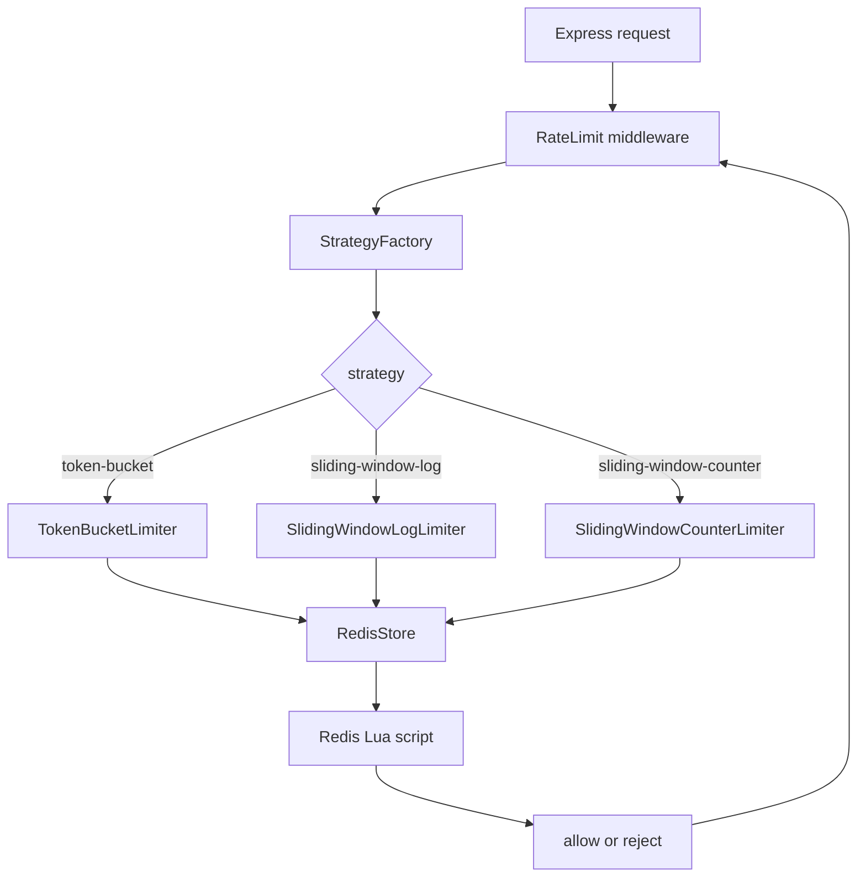

# Distrilimit

Distrilimit is a TypeScript rate-limiting middleware for Express built on Redis and Lua scripts. Version 1 focuses on three strategies: token bucket, sliding window log, and sliding window counter.

## Project Logo


## Badges

<p align="left">
  
  
  
  
</p>

## Introduction

Distrilimit adds per-client request limiting to an Express app with a small middleware wrapper. It uses Redis for shared state, so the same limits work across multiple app instances.

The public API is centered around `rateLimit(options)`, which returns Express middleware. The middleware selects a limiter strategy from the provided `strategy` value and applies the corresponding algorithm.

## Features

- Token bucket, sliding window log, and sliding window counter strategies.
- Redis-backed state for distributed deployments.
- Lua script execution for atomic limit checks.
- Express middleware integration.
- TypeScript source with explicit strategy configuration.

## Installation

To use Distrilimit in another project, install the published package:

```bash
npm install distrilimit@1.0.1
```

For local development in this repository:

```bash
npm install
```

You also need a running Redis instance and these environment variables:

```bash
REDIS_HOST=127.0.0.1
REDIS_PORT=6379
```

## Quick Start

After installing it in a fresh project, I use it like this:

```ts
import express from "express";
import dotenv from "dotenv";
import { rateLimit } from "distrilimit";

dotenv.config();

const app = express();

app.use(
  rateLimit({
    strategy: "token-bucket",
    capacity: 10,
    refillRatePerSecond: 2,
    redis: {
      host: process.env.REDIS_HOST!,
      port: Number(process.env.REDIS_PORT)!,
    },
  })
);

app.get("/profile", (req, res) => {
  res.send("Here is your profile user ->>>");
});

app.listen(3000, () => {
  console.log("Server listening on 3000");
});
```

To verify the package after publishing, I create a new project, install `distrilimit@1.0.1`, add the code above, start Redis, and run the app.

To run the example server in this repo:

```bash
npx ts-node-dev src/server.ts
```

## Architecture Diagram



## Algorithms

### Token Bucket

Token bucket stores a token count per client. Requests consume tokens, and tokens refill over time at a fixed rate. This is good when you want bursts to be allowed up to a configured capacity.

### Sliding Window Log

Sliding window log records request timestamps inside a moving time window. A request is allowed only if the number of timestamps in the active window stays under the limit.

### Sliding Window Counter

Sliding window counter estimates usage across adjacent windows using counters rather than storing every request timestamp. It is cheaper than the full log approach and still smooths bursts better than a fixed window.

## Benchmarks

I use two benchmark views in version 1:

1. Throughput benchmark: I measure library overhead when rate limiting is effectively disabled.
2. Rate-limit behavior benchmark: I verify that each strategy enforces the configured limit under load.

The throughput harness in [src/Benchmark/benchmark.ts](src/Benchmark/benchmark.ts) follows the first style by running the same number of requests through the strategy and calculating:

Latency = Time / Total Requests

Throughput = Total Requests / (Time / 1000)

Run it with:

```bash
npm run benchmark
```

### Throughput Benchmark

I run this with a very high capacity so almost every request is allowed:

```text
capacity = 1_000_000
```

This measures raw request-handling overhead through:

```text
Node -> Middleware/Strategy -> Redis -> Lua -> Return
```

It does not focus on rejection logic.

Example throughput output:

| Algorithm | Time (ms) | Latency (ms/request) | Throughput (req/s) | Allowed |
| --- | ---: | ---: | ---: | ---: |
| Token Bucket | 369 | 0.369 | 2710.0271 | 1000 |
| Sliding Window Log | 358 | 0.358 | 2793.2960 | 1000 |
| Sliding Window Counter | 404 | 0.404 | 2475.2475 | 1000 |

> Benchmark performed with rate limiting effectively disabled to measure library overhead rather than throttling behavior.

### Rate-Limit Behavior Benchmark

I run a second script in [src/Benchmark/rateLimitBehaviorBenchmark.ts](src/Benchmark/rateLimitBehaviorBenchmark.ts) to check that the limiter actually rejects requests.

I use a limiting configuration such as:

```text
capacity = 100
refill = 10
```

or:

```text
window = 10s
limit = 100
```

Then fire:

```text
1000 requests
```

This demonstrates the rejection path:

```text
Reject -> Retry calculation -> Extra logic
```

Example correctness output:

| Algorithm | Requests | Allowed | Rejected | Total Time (ms) |
| --- | ---: | ---: | ---: | ---: |
| Token Bucket | 1000 | 100 | 900 | xxx |
| Sliding Window Log | 1000 | 100 | 900 | 326 |
| Sliding Window Counter | 1000 | 100 | 900 | 273 |

I use this table to show that the algorithms enforce the configured limits correctly under load.

Run the behavior benchmark with:

```bash
npm run benchmark:behavior
```

Suggested metrics to record after each run:

- Requests per second.
- Median and p95 latency.
- Redis command latency.
- Rejection rate under each strategy.

### Benchmark Environment

I record the environment used for any published benchmark results so they stay reproducible and credible:

- CPU: your processor
- Node.js version
- Redis version
- OS
- Single-threaded benchmark
- Local Redis instance, for example Docker

## API Reference

### `rateLimit(options)`

Returns Express middleware configured with the selected strategy.

#### Common fields

- `strategy`: `"token-bucket"`, `"sliding-window-log"`, or `"sliding-window-counter"`.
- `redis.host`: Redis host.
- `redis.port`: Redis port.

#### Token bucket fields

- `capacity`: Maximum tokens stored in the bucket.
- `refillRatePerSecond`: Tokens added per second.

#### Sliding window fields

- `capacity`: Maximum allowed requests in the time window.
- `windowSizeMs`: Window size in milliseconds.

## Folder Structure

```text
src/
  createRateLimit.ts
  index.ts
  server.ts
  config/
  Factory/
  middleware/
  models/
  routes/
  scripts/
  server/
  store/
  strategies/
  types/
```

Key files:

- `src/createRateLimit.ts` wires the Redis store, strategy factory, and middleware together.
- `src/Factory/strategyFactory.ts` selects the limiter strategy.
- `src/store/redisStore.ts` executes the Lua scripts against Redis.
- `src/strategies/*` contains the limiter implementations.
- `src/scripts/*` contains the Lua scripts used for atomic checks.

## Contributing

1. Fork or clone the repository.
2. Create a feature branch.
3. Make focused changes.
4. Run the TypeScript checks and the example server.
5. Open a pull request with a clear summary.

## License

MIT